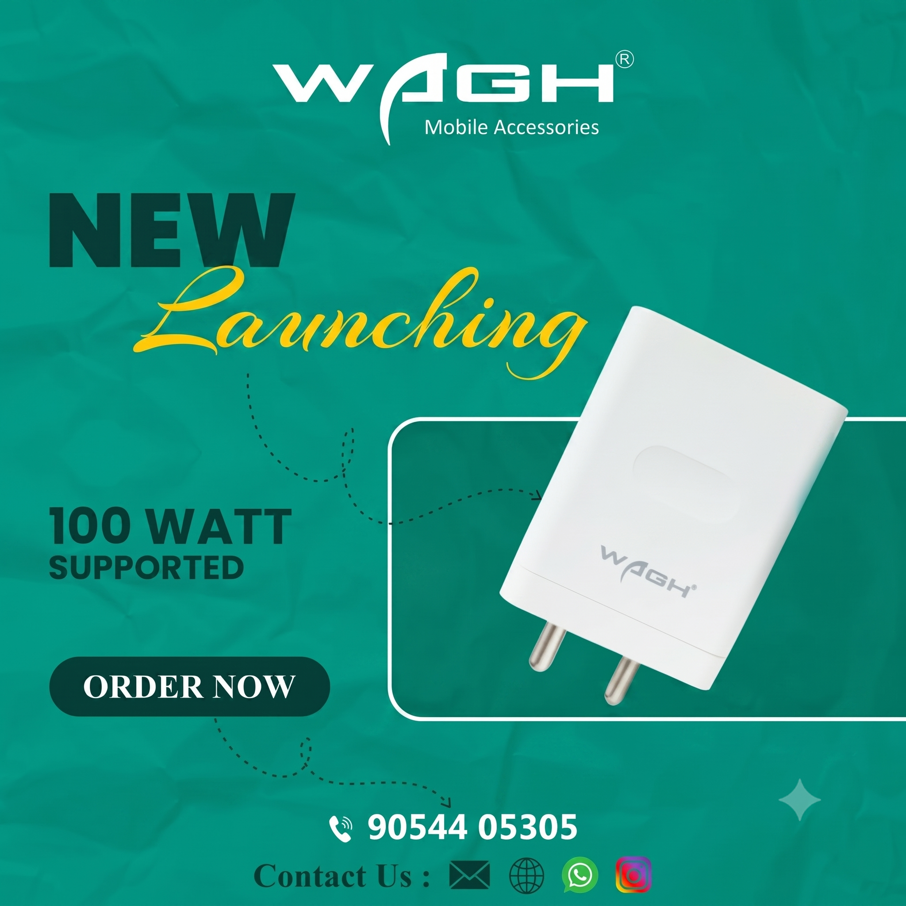
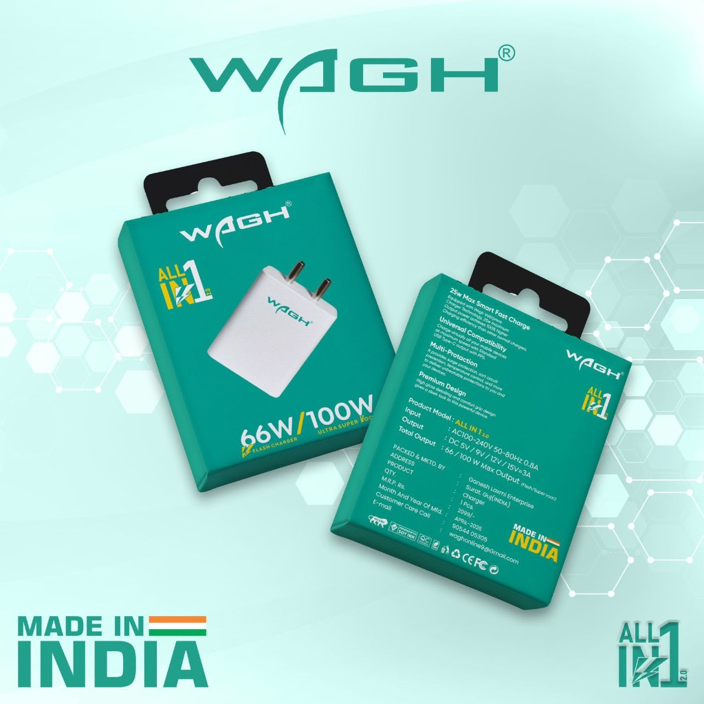

<div align="center">

  

  <br /><br />

  # ⚡ WAGH Mobile Accessories — Full MERN Stack Platform

  > *"Power that feels premium. Speed you can trust."*

  **[🌐 View Live Demo](https://wagh-e-commerce.vercel.app/)** • **[📦 GitHub Repository](https://github.com/devangpanchal23/1Wagh_E-Commerce)**

  <br />

  [](https://reactjs.org/)
  [](https://nodejs.org/)
  [](https://expressjs.com/)
  [](https://www.mongodb.com/)
  [](https://tailwindcss.com/)
  [](https://vitejs.dev/)
  [](https://wagh-e-commerce.vercel.app/)

</div>

---

## 📌 Overview

**WAGH Mobile Accessories** is a full-featured, modern E-Commerce web application built end-to-end using the MERN stack (MongoDB, Express.js, React 18, Node.js) with custom Tailwind CSS design tokens. 

Designed for high-performance mobile accessories retailing, it features interactive product showcases, multi-image product galleries, dynamic cart management, promo code validation, Razorpay & COD payment gateways, wishlist, user profiles, and an auth-gated administrative portal.

---

## 🛠️ Tech Stack & Architecture

### **Frontend**
- **Framework**: React 18 (Vite SPA)
- **Routing**: React Router v6
- **Styling**: Tailwind CSS with custom design tokens
- **Icons**: Lucide React Icons

### **Backend**
- **Runtime**: Node.js & Express.js (RESTful API, MVC Architecture)
- **Database**: MongoDB Atlas with Mongoose ORM
- **Authentication**: JWT (JSON Web Tokens) with HTTP-only security & `bcryptjs` password hashing

### **Design Tokens**
| Token | Value | Usage |
| :--- | :--- | :--- |
| **Primary Deep Teal** | `#0D5C52` | Brand Headers & Core Accents |
| **Accent Amber Gold** | `#D4A94F` | CTA Buttons & Badges |
| **Off-White BG** | `#FAF9F6` | Light-mode canvas background |
| **Headlines Font** | `Fraunces` | Bold luxury headlines |
| **Body Font** | `Manrope` | Clean body typography |
| **Badges Font** | `Space Mono` | Price tags & code badges |

---

## 🚀 Quick Start & Installation

### Prerequisites
- [Node.js](https://nodejs.org/) (v16+)
- [MongoDB](https://www.mongodb.com/) (Local instance or MongoDB Atlas Connection URI)

---

### 1️⃣ Backend Setup & Database Seeding

```bash
# Navigate to backend directory
cd server

# Install dependencies
npm install

# Seed database with sample 45W Chargers, Power Banks, Cables, Audio & Admin user
npm run seed

# Start development REST API server (Runs on http://localhost:5050)
npm run dev
```

#### 🔑 Default Seeded Credentials

| Role | Email | Password | Access Level |
| :--- | :--- | :--- | :--- |
| 🛡️ **Admin** | `admin@wagh.com` | `admin123password` | Full CRUD & Statistics Portal |
| 👤 **Customer** | `devang@example.com` | `customer123password` | Storefront & User Dashboard |

---

### 2️⃣ Frontend Setup & Development Server

```bash
# Navigate to frontend directory
cd client

# Install dependencies
npm install

# Start Vite React development server (Runs on http://localhost:5173)
npm run dev
```

---

## 🌐 Application Routes

| Route | Page | Description |
| :--- | :--- | :--- |
| `/` | **Home** | Hero banner, Stat strip, Feature grid, Best Sellers, Flagship banner, Trust strip, Newsletter |
| `/shop` | **Shop Catalog** | Catalog with category/price/stock sidebar filters, sorting, and pagination |
| `/product/:id` | **Product Detail** | 4-image interactive gallery, product specifications, customer reviews |
| `/cart` | **Cart** | Stepper quantity adjustments, promo code `WAGH200`, subtotal/shipping totals |
| `/checkout` | **Checkout** | Shipping address form, Razorpay test mode / COD selection, order confirmation |
| `/about` | **About Brand** | Brand narrative, mission, 3 WAGH pillars, and warranty highlights |
| `/contact` | **Contact Us** | Interactive form, phone (+91 90544 05305), email, HQ info |
| `/profile` | **User Profile** | Auth tabbed forms (Login/Register), profile details, order history, saved wishlist |
| `/admin` | **Admin Portal** | Auth-gated dashboard: Product CRUD with 4-image URL uploads, order management & statistics |

---

## 🖼️ Media & Branding

<div align="center">
  
</div>

---

## 📄 License & Attribution

Distributed under the MIT License. Forked from [waghOnline/Wagh_E-Commerce](https://github.com/waghOnline/Wagh_E-Commerce) and maintained by [Devang Panchal](https://github.com/devangpanchal23).